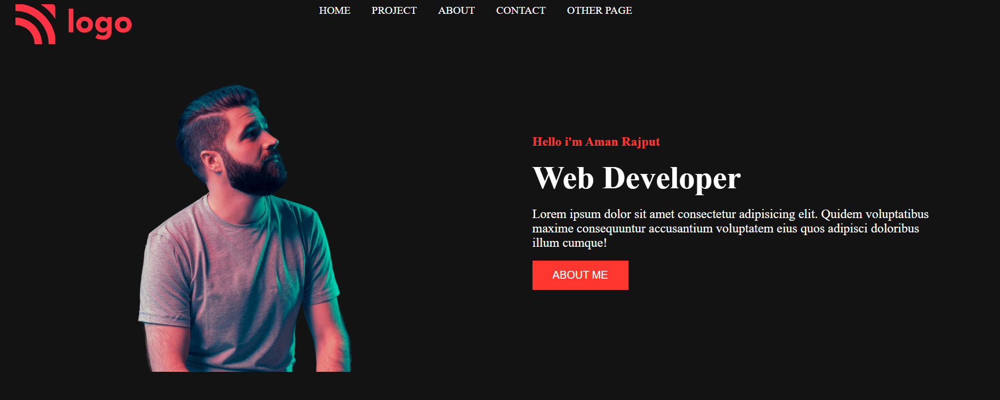
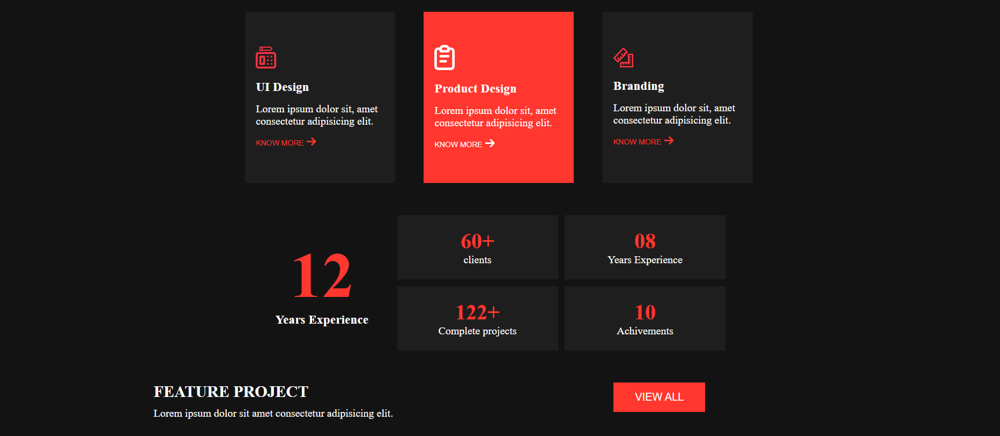
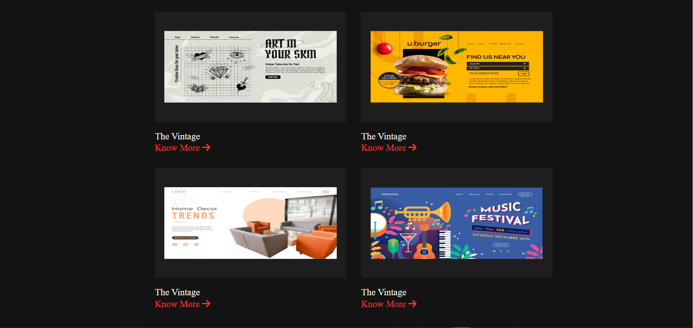
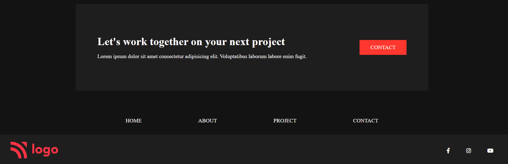
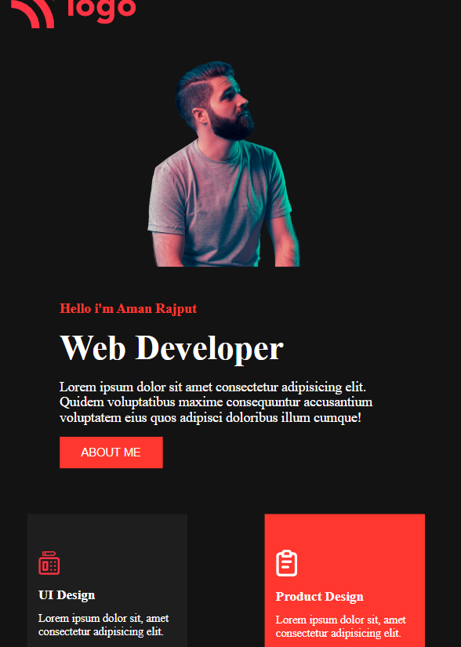
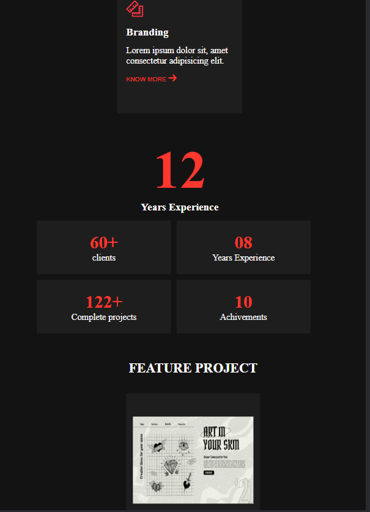
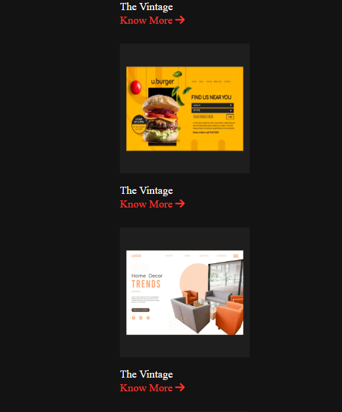
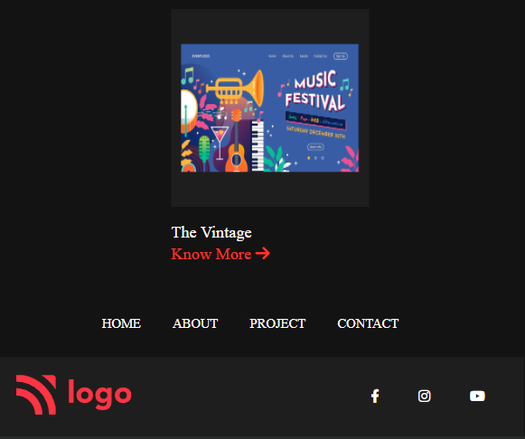

# project-15 #
[project-live](https://fswd-project15.netlify.app)
   - - - -
 # Technology used in this project #
    

   - - - - 
* Skill Gained in this project
  * Learned to make website responsive for multiple screen using __Media Queries__
  * Learned to used change direction of content in row or colum  and align item  using 
  __flex-direction__, __justifycontent__
  ,__align item__
 
  * Learned to crete button using
  __padding__  and __border radius__
  * Learned to make footer for website 
  
 ## Time taken to complete this project ##
 * 6 to  7 hrs  to completed this poject
 
 ## Destop view ##
 
  
 
 
 

 ## Moblie View
 
 
  
   